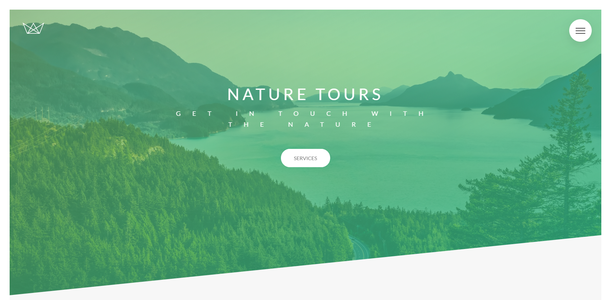
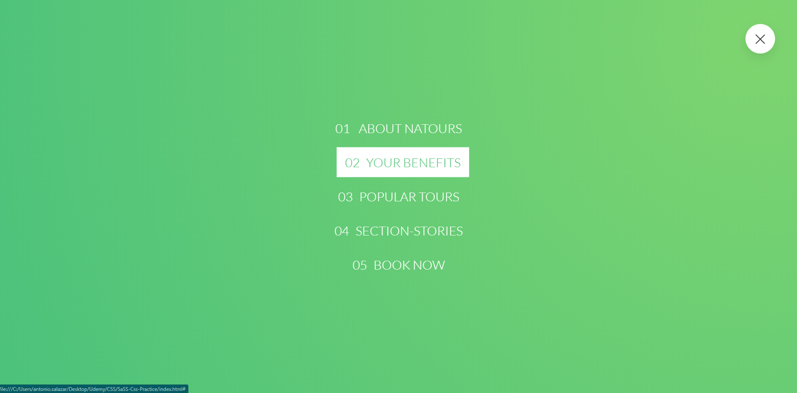
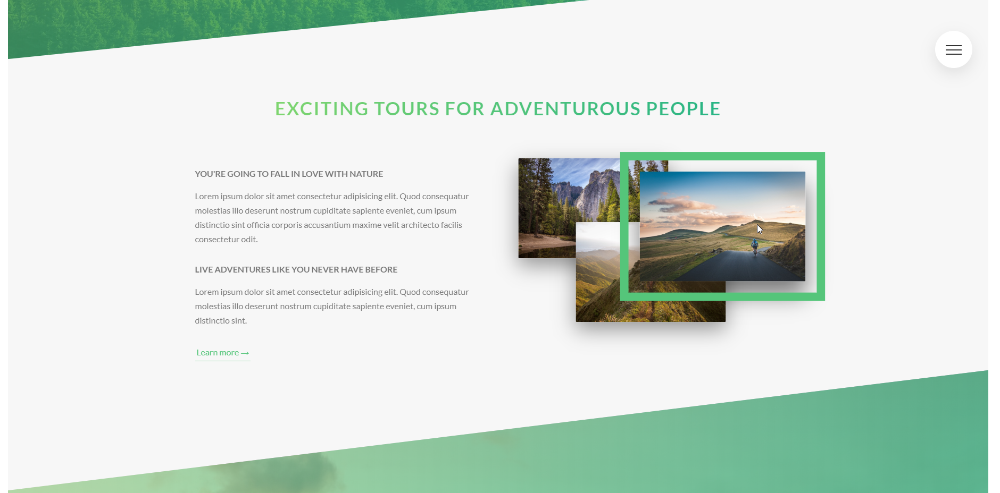
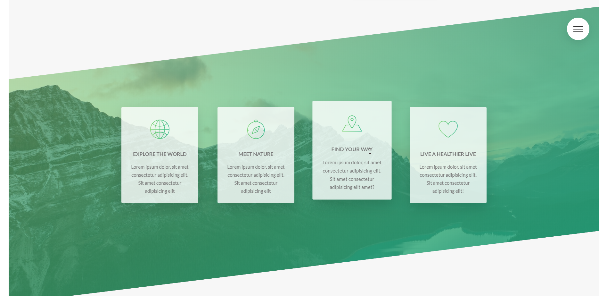
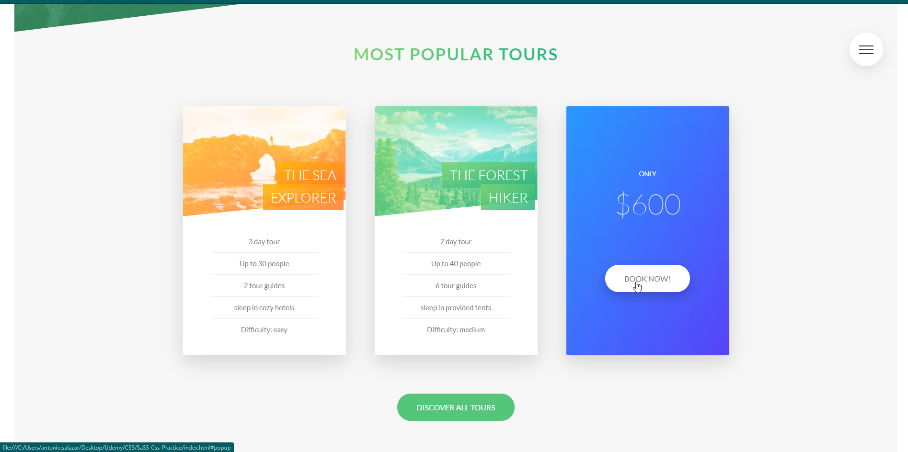
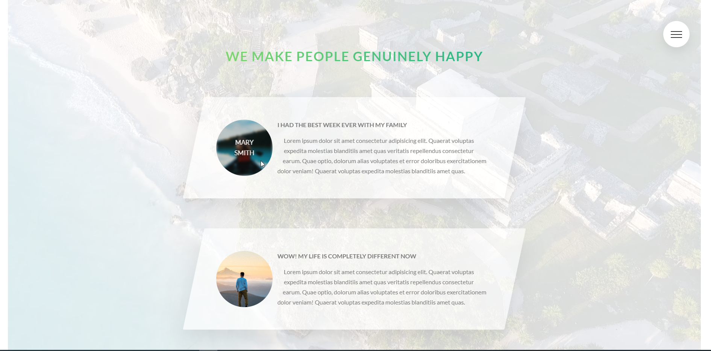
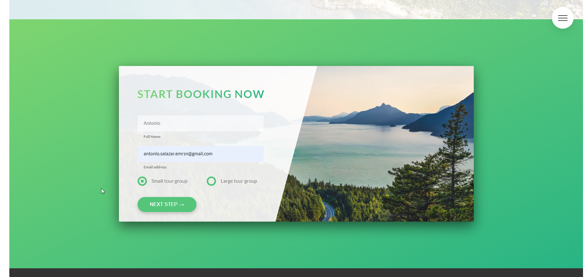
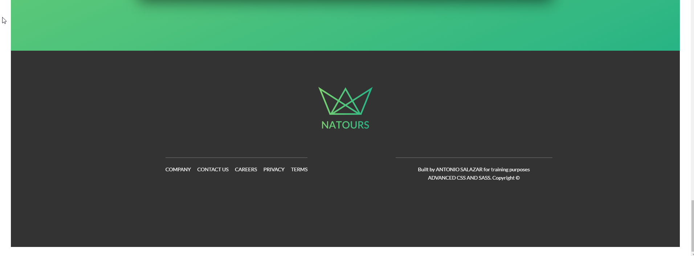

Project created for learning purposes.

Tried a lot of SaSS cool stuff :)

For you to be able to see the project you just need to open the index.html file

If you want to clone the repository run the 'npm install' command, this will only add the 'node-sass' package that is used as a dev dependencie.

And the 'npm run compile:sass"

This command will run the next script from the package.json:

"scripts": {
    "compile:sass": "node-sass sass/main.scss css/style.css -w"
}

This adds the changes from sass files into the style.css file.

Some screenshot of the project -->

If you click on the menu icon the next options will be displayed:

There is an 'about us' section:

Following that section you can find the 'options' section, if you hover over one of the options it will scaleup:

After the above part you will see 3 different tours available, if you hover over one of the tours the card will rotate and you will be able to click on the 'book now!' button:

Coming right after the tours section you will see the 'opinions' section, the background of this part is a video and if you hover over one of the opinions the image will be changed for the name of the user:

One of the final sections is the 'booking' section:

Last but not least is the footer:

:stuck_out_tongue_closed_eyes:
